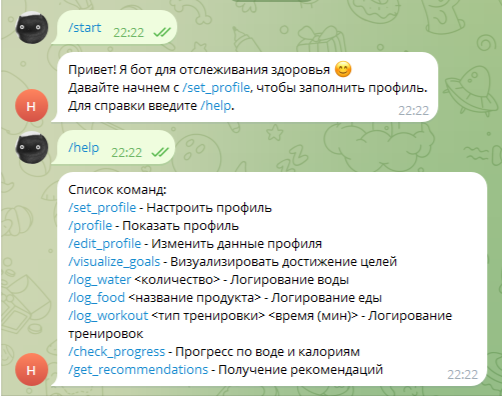
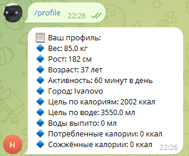

# Health bot
Telegram-bot для слежения за здоровьем.

## Развертывание проекта
```
cp env-example .env
```
- Прописать в .env необходимые токены
- Выполнить команду
```
docker-compose up -d
```

## Дополнительная функциональность
- Реализована визуализация достижения целей по воде и калориям в виде столбиковых диаграмм
- Реализована выдача рекомендаций на основании активности и целей по воде и калориям
- К определению калорийности через сервис OpenFoodFacts была добавлена возможность задания калорийности вручную, если продукт не найден в базе сервиса

## Демонстрация работы бота
### Начало работы


### Работа с профилем





### Логирование воды, еды и тренировок


### Прогресс по воде и калориям


### Визуализация достижения целей


### Получение рекомендаций


## Демонстрация деплоя на онлайн-сервер
